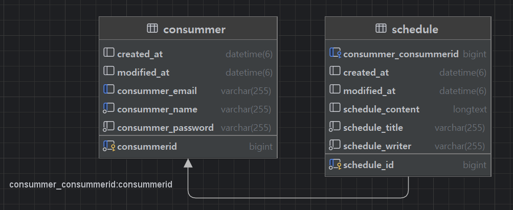

# Schedule and Consummer

## 1️⃣ API

### Schedule API

| **Method** | **Endpoint**         | **Description**                     | **Parameters**                                                                            | **Request Body**                                                                                                 | **Response**                                                                                                                                     | **Status Code** |
|------------|----------------------|-------------------------------------|-------------------------------------------------------------------------------------------|------------------------------------------------------------------------------------------------------------------|--------------------------------------------------------------------------------------------------------------------------------------------------|-----------------|
| `POST`     | `/schedules`         | 일정 생성                           | 없음                                                                                        | `{ "scheduleTitle": string, "scheduleContent": string, "scheduleWriter": string, "schedulePassword": string }`   | `{ "scheduleId": long, "scheduleTitle": string, "scheduleContent": string, "scheduleWriter": string, "scheduleCreatedAt": string, "scheduleUpdatedAt": string }` | `200 OK`        |
| `GET`      | `/schedules`         | 일정 목록 조회                      | Query:   - `scheduleUpdatedAt` (예: "2025-02-02", `optional`)   - `scheduleWriter` (`optional`) | 없음                                                                                                             | `[ { "scheduleId": long, "scheduleTitle": string, "scheduleContent": string, "scheduleWriter": string, "scheduleCreatedAt": string, "scheduleUpdatedAt": string }, ... ]` | `200 OK`        |
| `GET`      | `/schedules/{id}`    | 일정 단건 조회                       | Path:   - `id`                                                                         | 없음                                                                                                             | `{ "scheduleWriter": string, "scheduleTitle": string, "scheduleContent": string, "scheduleCreatedAt": string, "scheduleUpdatedAt": string }`      | `200 OK`        |
| `PUT`      | `/schedules/{id}`    | 일정 수정                            | Path:   - `id`                                                                         | `{ "scheduleTitle": string, "scheduleContent": string, "scheduleWriter": string, "schedulePassword": string }`   | `{ "scheduleWriter": string, "scheduleTitle": string, "scheduleContent": string, "scheduleCreatedAt": string, "scheduleUpdatedAt": string }`      | `200 OK`        |
| `DELETE`   | `/schedules/{id}`    | 일정 삭제                           | Path:   - `id`   Query:   - `schedulePassword` (`mandatory`)                              | 없음                                                                                                             | 없음                                                                                                                                             | `200 OK`        |

### User API

| **Method** | **Endpoint**         | **Description**                     | **Parameters**                                                                            | **Request Body**                                                                                                 | **Response**                                                                                                                                     | **Status Code** |
|------------|----------------------|-------------------------------------|-------------------------------------------------------------------------------------------|------------------------------------------------------------------------------------------------------------------|--------------------------------------------------------------------------------------------------------------------------------------------------|-----------------|
| `POST`     | `/users`             | 유저 생성                           | 없음                                                                                        | `{ "consummerName": string, "consummerEmail": string, "consummerPassword": string }`                            | `{ "consummerId": long, "consummerName": string, "consummerEmail": string, "consummerCreatedAt": string, "consummerUpdatedAt": string }`        | `200 OK`        |
| `GET`      | `/users`             | 유저 목록 조회                      | Query:   - `consummerName` (`optional`)                                                   | 없음                                                                                                             | `[ { "consummerId": long, "consummerName": string, "consummerEmail": string, "consummerCreatedAt": string, "consummerUpdatedAt": string }, ... ]`   | `200 OK`        |
| `GET`      | `/users/{id}`        | 유저 단건 조회                       | Path:   - `id` (유저 ID)                                                                 | 없음                                                                                                             | `{ "consummerId": long, "consummerName": string, "consummerEmail": string, "consummerCreatedAt": string, "consummerUpdatedAt": string }`         | `200 OK`        |
| `PUT`      | `/users/{id}`        | 유저 정보 수정                       | Path:   - `id` (유저 ID)                                                                 | `{ "consummerName": string, "consummerEmail": string, "consummerPassword": string }`                            | `{ "consummerId": long, "consummerName": string, "consummerEmail": string, "consummerCreatedAt": string, "consummerUpdatedAt": string }`         | `200 OK`        |
| `DELETE`   | `/users/{id}`        | 유저 삭제                           | Path:   - `id` (유저 ID)   Query:   - `consummerPassword` (`mandatory`)            | 없음                                                                                                             | 없음                                                                                                                                             | `200 OK`        |

### Login API

| **Method** | **Endpoint**         | **Description**                     | **Parameters**                                                                            | **Request Body**                                                                                                 | **Response**                                                          | **Status Code** |
|------------|----------------------|-------------------------------------|-------------------------------------------------------------------------------------------|------------------------------------------------------------------------------------------------------------------|-----------------------------------------------------------------------|-----------------|
| `POST`     | `/login`             | 로그인                             | 없음                                                                                        | `{ "consummerEmail": string, "consummerPassword": string }`                                                    | `{ "message": string, "consummerId": long, "consummerName": string }` | `200 OK`        |
| `POST`     | `/logout`            | 로그아웃                            | 없음                                                                                        | 없음                                                                                                             | 없음                                                                    | `200 OK`        |

## 2️⃣ 예외 처리

| **Error Code**        | **Message**                 | **HTTP Status**    | **Description**                                      |
|-----------------------|-----------------------------|--------------------|------------------------------------------------------|
| `C001`                | 잘못된 입력값입니다.         | `400 Bad Request`  | 클라이언트에서 잘못된 값을 입력한 경우              |
| `C002`                | 사용자를 찾을 수 없습니다.  | `404 Not Found`    | 이메일로 해당 사용자를 찾을 수 없는 경우           |
| `C003`                | 이미 존재하는 이메일입니다. | `409 Conflict`     | 이메일 중복 시 발생                                |
| `C004`                | 비밀번호가 일치하지 않습니다.| `401 Unauthorized` | 로그인 시 비밀번호가 맞지 않는 경우                |
| `C005`                | 로그인이 필요합니다.        | `401 Unauthorized` | 로그인이 필요한 리소스 접근 시 발생                 |
| `C006`                | 작성 권한이 없습니다.       | `403 Forbidden`    | 권한이 없는 사용자가 접근할 때 발생                |
| `C007`                | 일정을 수정/삭제할 권한이 없습니다. | `403 Forbidden`    | 다른 사용자의 일정 수정/삭제 시 발생               |
| `C008`                | 일정을 찾을 수 없습니다.    | `404 Not Found`    | 주어진 ID로 일정을 찾을 수 없는 경우               |
| `C009`                | 이미 로그인된 사용자가 있습니다. | `409 Conflict`     | 이미 로그인된 사용자가 로그인하려 할 때 발생      |

### SQL

